# EuroOne - Aplicativo Android (Kotlin)

Aplicativo Android desenvolvido em **Kotlin** com **Jetpack Compose** e arquitetura **MVVM** para a **Sprint 3** do desafio FIAP em parceria com o **Instituto Eurofarma**.

O EuroOne é uma plataforma educacional gamificada que unifica em um único produto a experiência dos três perfis que atuam nas trilhas de aprendizagem do Instituto Eurofarma (Educando, Educador e Gestão), promovendo engajamento, acompanhamento pedagógico contínuo e visão executiva consolidada.

---

## Equipe IVONE

| Nome                              | RM         |
|-----------------------------------|------------|
| Karine Nascimento                 | RM 558810  |
| Lucas Almeida Bel Correa          | RM 558539  |
| Guilherme Tusita                  | RM 554511  |
| Matheus Richard Hadermeck         | RM 557221  |

---

## Repositório

Link do repositório no GitHub: **https://github.com/IV-ONE-team/euroone-kotlin**

Estrutura do repositório:

```
euroone-kotlin/
├── app/                         # Módulo Android
│   ├── build.gradle.kts
│   └── src/main/
│       ├── AndroidManifest.xml
│       ├── java/IV_ONE_team/com/github/euroone_kotlin/
│       │   ├── MainActivity.kt
│       │   ├── data/            # Mocks (MockDataProvider)
│       │   ├── model/           # Data classes de domínio
│       │   ├── repository/      # Repositórios (Auth, Educando, Educador, Gestão)
│       │   ├── viewmodel/       # ViewModels (MVVM)
│       │   ├── navigation/      # Rotas e NavHost
│       │   └── ui/              # Tema, componentes e telas Compose
│       └── res/                 # Recursos Android (ícones, cores, mascote)
├── build.gradle.kts
├── settings.gradle.kts
├── gradle/libs.versions.toml
├── gradle/wrapper/*
├── gradlew, gradlew.bat
├── images/                      # Prints das telas usados neste README
├── commits.md                   # Plano de commits por integrante
└── README.md
```

---

## Contexto e problema abordado

O Instituto Eurofarma oferece trilhas de aprendizagem para três públicos: **educandos** (alunos), **educadores** (corpo docente) e **gestão** (coordenação/direção). Nas Sprints anteriores identificamos que a experiência atual é **fragmentada**: cada perfil usa canais/ferramentas diferentes, o educando recebe pouco feedback de progresso, o educador não enxerga em tempo real quais alunos precisam de apoio e a gestão não possui indicadores consolidados para decidir onde investir.

O **EuroOne** ataca esse problema oferecendo um **único aplicativo** com jornada personalizada por perfil, gamificação para o educando (missões, pontos, recompensas, emblemas), painel de acompanhamento e fila de alertas para o educador e dashboard executivo com fila de cuidado prioritária para a gestão.

---

## Requisitos funcionais implementados (Sprint 3)

Os requisitos funcionais abaixo foram escolhidos e implementados nesta Sprint 3 como MVP navegável do EuroOne. Estão agrupados por perfil e endereçam diretamente as dores identificadas no pitch.

### Transversais (todos os perfis)

- **RF-01 - Autenticação por email/senha** com validação contra base mockada e redirecionamento para a home correta de acordo com o perfil do usuário.
- **RF-02 - Sessão ativa** mantida em memória via `AuthViewModel` + `StateFlow`, exposta a todas as telas.
- **RF-03 - Logout** disponível na TopBar de qualquer tela interna e também no perfil do educando.
- **RF-04 - Navegação multi-tela** com passagem de parâmetros (courseId, classId, studentId, educatorId) usando Navigation Compose.

### Perfil Educando

- **RF-05 - Home personalizada** com saudação, métricas de progresso, pontos, faltas e sequência (streak).
- **RF-06 - Missões gamificadas** com título, descrição, pontos e prazo (há missões concluídas e em aberto).
- **RF-07 - Cursos em andamento** com barra de progresso, professor, turma, próxima aula e status.
- **RF-08 - Detalhe do curso** com módulo atual, aulas assistidas/total, atividades concluídas/pendentes.
- **RF-09 - Catálogo de recompensas** com itens desbloqueados/bloqueados e custo em pontos.
- **RF-10 - Perfil do educando** com dados institucionais, nível, pontos, ranking e emblemas (badges) com progresso individual.
- **RF-11 - Prazos importantes** listados na home com status e progresso.

### Perfil Educador

- **RF-12 - Painel do educador** com nome, matrícula, disciplinas e métricas agregadas (turmas, alunos, presença média, engajamento médio).
- **RF-13 - Fila de alertas pedagógicos** com aluno, nível do alerta, motivo e ação recomendada.
- **RF-14 - Listagem de turmas** com disciplina, cronograma, sala, módulo em curso, presença e engajamento.
- **RF-15 - Detalhe da turma** com indicadores consolidados (alunos, presença, engajamento) e período.
- **RF-16 - Listagem de alunos** com status pedagógico (engajado / atenção / risco), presença, engajamento e pendentes.
- **RF-17 - Detalhe do aluno** com ação pedagógica recomendada pelo sistema.

### Perfil Gestão

- **RF-18 - Painel executivo** com métricas globais (educandos ativos, engajamento geral, educadores, cursos) e variação (delta) trimestral.
- **RF-19 - Fila de cuidado prioritária** com casos críticos (educando ou turma), motivo e status da intervenção.
- **RF-20 - Listagem de cursos gerenciados** com alunos, engajamento, conclusão, delta e badge de alerta quando houver.
- **RF-21 - Detalhe do curso** com indicadores e status pedagógico.
- **RF-22 - Listagem de educadores** com engajamento, variação e status.
- **RF-23 - Detalhe do educador** com highlights e status pedagógico.

### Justificativa da priorização

A priorização foi feita pela **importância técnica de cada escopo dentro de um MVP Android**, garantindo que a base sustente as camadas superiores e que cada bloco entregue exercite recursos avaliados na Sprint. Seguimos, nesta ordem:

1. **Fundação da aplicação (RF-01 a RF-04)** - autenticação, sessão em memória, logout e navegação multi-tela são pré-requisitos para qualquer outra funcionalidade existir. Sem uma sessão válida e sem um NavHost funcional, nenhuma tela de perfil consegue receber usuário nem passar parâmetros. Por isso essa camada foi implementada primeiro e serve de contrato para todo o resto do aplicativo.

2. **Telas principais de cada perfil (RF-05, RF-12, RF-18)** - as telas de entrada dos três perfis (home do educando, painel do educador e painel da gestão) foram priorizadas porque são as que carregam a maior densidade de informação e componentes reutilizáveis (`MetricCard`, `SectionHeader`, `EuroCard`, `StatusChip`). Elas definem o padrão visual e de estado que todas as demais telas seguem, então concluí-las cedo evita retrabalho.

3. **Fluxos lista → detalhe com passagem de parâmetro (RF-08, RF-14 a RF-17, RF-20 a RF-23)** - implementados na sequência porque exercitam explicitamente três recursos técnicos avaliados na Sprint: (i) navegação com argumentos tipados, (ii) listas dinâmicas com `LazyColumn` e (iii) reaproveitamento de ViewModel entre telas do mesmo perfil. Cobrir esse fluxo nos três perfis demonstra domínio consistente do padrão, e não apenas em um lugar isolado.

4. **Gamificação e telas de apoio (RF-06, RF-07, RF-09, RF-10, RF-11, RF-13, RF-19)** - implementados por último porque dependem das camadas anteriores (modelo, repositório e ViewModel já prontos) e são principalmente **camadas de apresentação** sobre dados já modelados. Concentram o valor percebido pelo usuário final (gamificação, alertas, fila de cuidado) e, por serem incrementais sobre uma base já pronta, puderam ser desenvolvidos em paralelo pelos integrantes sem conflitos de merge.

Ficaram fora desta Sprint (para próximas iterações): notificações push, fluxo de resgate real das recompensas, edição de perfil, chamada/frequência via QR Code e integração com backend real (todas fora do escopo da Sprint 3, que exige apenas dados mockados).

---

## Como executar

### Requisitos

- **Android Studio**: **Ladybug 2024.2.1** (Patch 3) ou superior. Versões mais antigas podem falhar por incompatibilidade com o **plugin Compose do Kotlin 2.0.20**.
- **JDK**: 17 ou superior (embutido no Android Studio a partir do Ladybug).
- **Android SDK**: API **24** (minSdk) - API **34** (compile/target).
- **Gradle**: 8.9 (baixado automaticamente pelo wrapper).

### Passos

1. Clone o repositório:
   ```bash
   git clone https://github.com/IV-ONE-team/euroone-kotlin.git
   ```
2. Abra o diretório `euroone-kotlin/` no Android Studio (`File > Open...`).
3. Aguarde o Gradle sincronizar. Na primeira vez, o Android Studio baixará todas as dependências listadas em `gradle/libs.versions.toml`.
4. Selecione um dispositivo (emulador **API 24 ou superior** ou dispositivo físico) e clique em **Run 'app'**.
5. Faça login com uma das credenciais de demonstração (veja a próxima seção).

Nenhuma variável de ambiente ou arquivo `local.properties` extra precisa ser configurado além do padrão do Android Studio.

### Dependências relevantes

Todas as versões ficam centralizadas em `gradle/libs.versions.toml`. As principais:

| Dependência                               | Versão        |
|-------------------------------------------|---------------|
| Kotlin                                    | 2.0.20        |
| Android Gradle Plugin                     | 8.5.2         |
| Compose BOM (androidx.compose)            | 2024.09.02    |
| Material 3                                | via BOM       |
| Material Icons Extended                   | via BOM       |
| AndroidX Activity Compose                 | 1.9.2         |
| AndroidX Lifecycle (Runtime + ViewModel)  | 2.8.6         |
| Navigation Compose                        | 2.8.1         |
| Core KTX                                  | 1.13.1        |

---

## Credenciais de demonstração

Todas usam a senha padrão **`123456`** e estão listadas na tela de login (basta tocar no cartão para preencher os campos automaticamente).

| Perfil     | Email                        |
|------------|------------------------------|
| Educando   | `aluno@gmail.com`            |
| Educador   | `pf_9821@gmail.com`          |
| Educador   | `pf_102030@gmail.com`        |
| Gestão     | `eurone_1029@gmail.com`      |
| Gestão     | `eurone_998877@gmail.com`    |

---

## Telas implementadas (evidências de execução)

Todos os prints abaixo foram capturados **com o aplicativo rodando em emulador Android** a partir do build gerado pelo próprio projeto deste repositório (não são mockups de Figma). Os arquivos originais estão na pasta `images/` na raiz do projeto.

### 1. Login (`LoginScreen`)
Tela de autenticação com identidade visual institucional Eurofarma. Apresenta o mascote **Euri**, campos de email/senha com toggle de visibilidade, feedback de erro em caso de credenciais inválidas e painel de acessos de demonstração para facilitar a avaliação (basta tocar no perfil para preencher os campos).

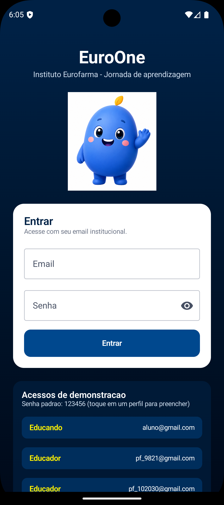

### 2. Home do Educando (`EducandoHomeScreen`)
Home do aluno com saudação personalizada, cartões de métricas (progresso, pontos, faltas, sequência), atalhos rápidos, missões gamificadas, cursos em andamento (com barras de progresso) e prazos importantes.

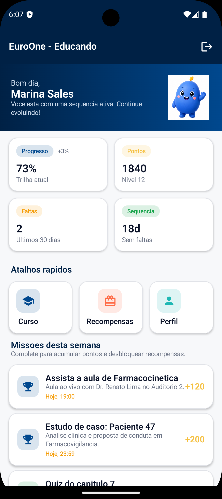

### 3. Detalhe do Curso do Educando (`EducandoCursoScreen`)
Aberta ao tocar em um curso na home. Recebe o `courseId` como parâmetro de navegação e exibe informações completas do curso: módulo atual, próxima aula, aulas assistidas, atividades concluídas e pendentes.

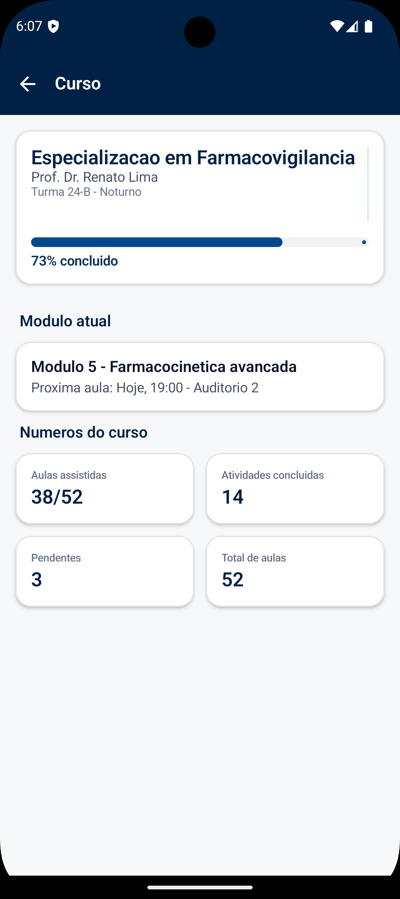

### 4. Recompensas do Educando (`EducandoRecompensasScreen`)
Catálogo gamificado com itens que podem ser trocados pelos pontos acumulados pelo aluno. Destaque visual para recompensas bloqueadas x disponíveis, seguindo a mecânica de progressão.

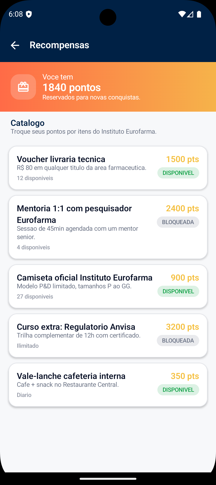

### 5. Perfil do Educando (`EducandoPerfilScreen`)
Perfil institucional do educando com dados pessoais, progressão (nível, pontos, ranking) e emblemas conquistados (com progresso individual). Inclui botão de logout.

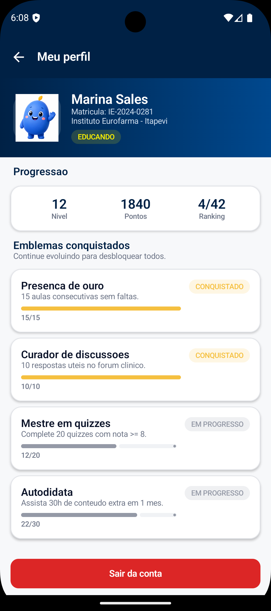

### 6. Painel do Educador (`EducadorOverviewScreen`)
Dashboard do educador com métricas agregadas (turmas, alunos, presença, engajamento) e fila de alertas pedagógicos priorizada pelo sistema.

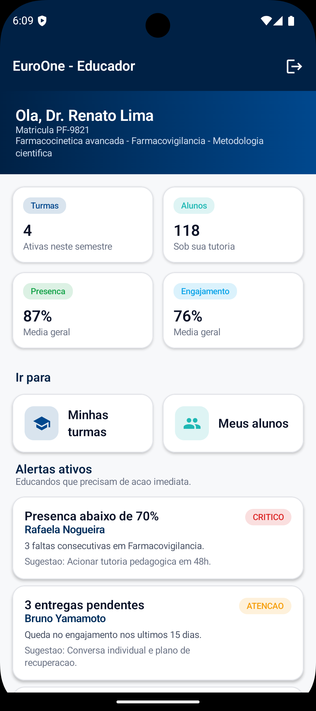

### 7. Turmas do Educador (`EducadorTurmasScreen` + `EducadorTurmaDetalheScreen`)
Lista de turmas ativas e, ao tocar em qualquer turma, tela de detalhamento com cronograma, sala, módulo em curso e indicadores.

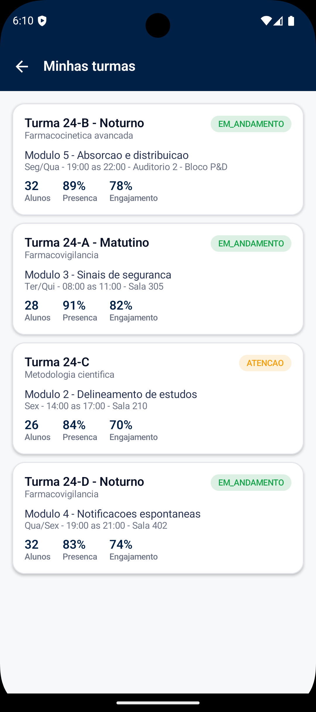

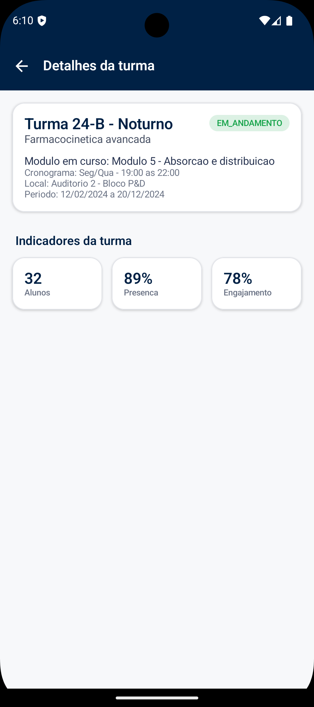

### 8. Alunos do Educador (`EducadorAlunosScreen` + `EducadorAlunoDetalheScreen`)
Lista de alunos sob tutoria do educador com status pedagógico (engajado / atenção / risco) e, ao tocar, detalhamento individual com ação pedagógica recomendada pelo sistema.

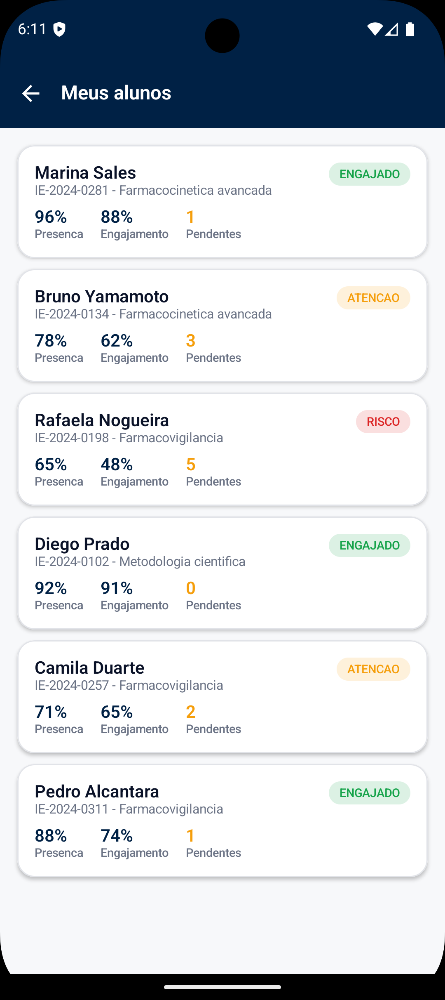

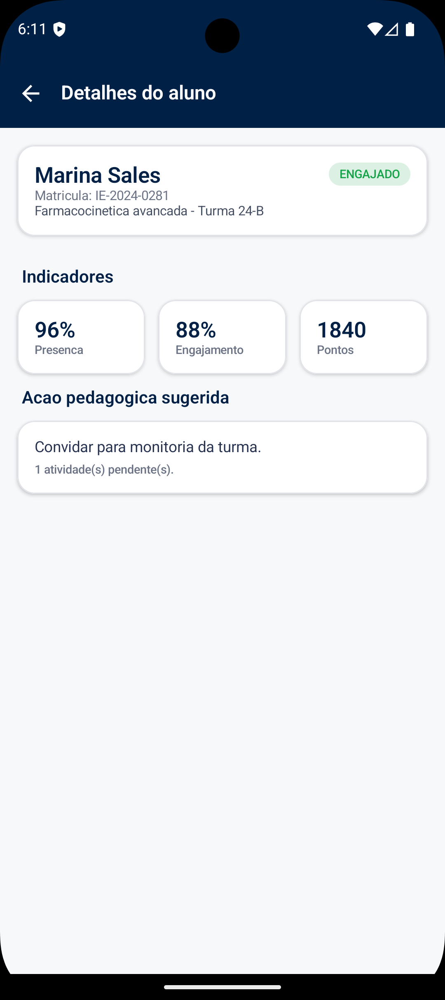

### 9. Painel da Gestão (`GestaoOverviewScreen`)
Dashboard executivo com métricas globais (educandos ativos, engajamento, educadores, cursos), atalhos e fila de cuidado prioritária destacando casos que precisam de intervenção imediata.

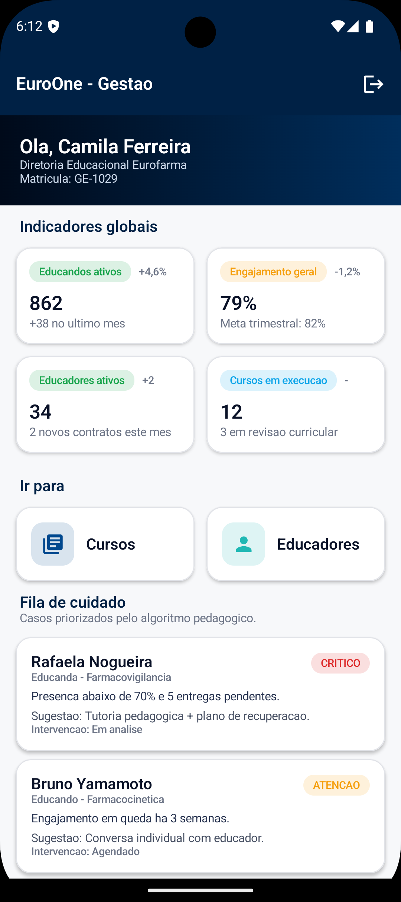

### 10. Cursos e Educadores da Gestão

Telas executivas para acompanhamento de cursos e educadores com badges de alerta e indicadores consolidados. Ambas seguem o mesmo padrão lista → detalhe com passagem de parâmetro por rota.

`GestaoCursosScreen` + `GestaoCursoDetalheScreen`:

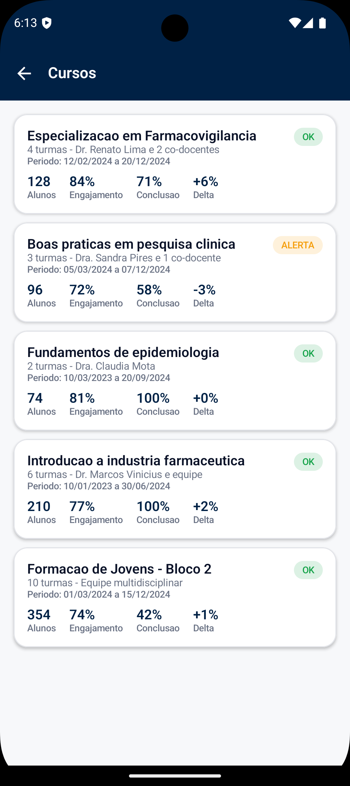

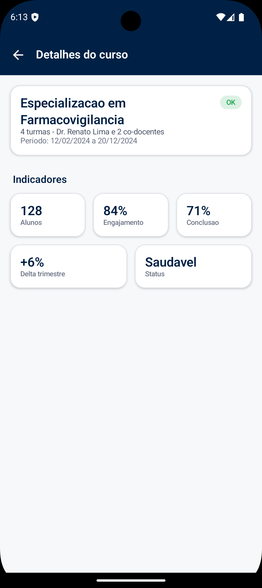

`GestaoEducadoresScreen` + `GestaoEducadorDetalheScreen`:

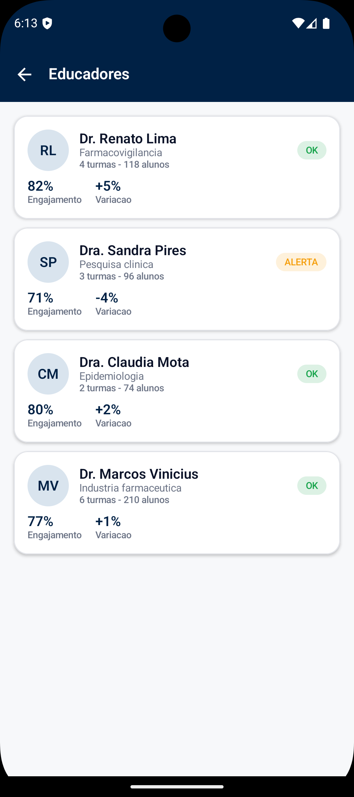

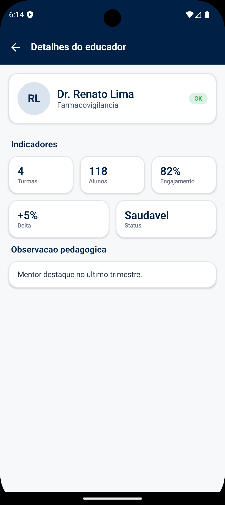

---

## Dados mockados

Toda a informação apresentada em tela é fornecida pelo objeto `MockDataProvider` (localizado em `app/src/main/java/IV_ONE_team/com/github/euroone_kotlin/data/`). Os dados são **coerentes com o domínio Eurofarma** (Farmacovigilância, Bioequivalência, Pesquisa Clínica, Epidemiologia, Formação de Jovens) e replicam a estrutura do protótipo original em Flutter, garantindo continuidade entre as sprints.

Não há integração com API externa, Firebase ou banco de dados nesta Sprint 3, conforme especificado no enunciado do desafio. Um `delay(400ms)` foi adicionado no `AuthRepository` **apenas para simular a latência de rede** e permitir que a UI mostre o estado de "Entrando..." de forma realista.

### Entidades mockadas

Cada entidade abaixo possui uma **data class** correspondente em `model/` e uma **lista mockada** em `MockDataProvider`, consumida pelos respectivos `Repository` da camada `repository/`:

| Categoria             | Entidade (`model/`)     | Onde é usado                             |
|-----------------------|-------------------------|------------------------------------------|
| Sessão/perfil         | `User`, `UserRole`      | Login e todas as TopBars                 |
| Educando - resumo     | `EducandoSnapshot`      | Home + perfil do educando                |
| Educando - progresso  | `CourseProgress`        | Home + detalhe do curso                  |
| Educando - gamif.     | `Mission`               | Home (missões da semana)                 |
| Educando - gamif.     | `RewardItem`            | Tela de recompensas                      |
| Educando - gamif.     | `BadgeInfo`             | Perfil do educando                       |
| Educando - prazos     | `ActivityDeadline`      | Home (prazos importantes)                |
| Educador - perfil     | `EducatorProfile`       | Painel do educador                       |
| Educador - turmas     | `EducatorClassInfo`     | Lista + detalhe de turmas                |
| Educador - alunos     | `StudentListItem`       | Lista + detalhe de alunos                |
| Educador - alertas    | `AlertItem`             | Fila de alertas                          |
| Gestão - perfil       | `ManagementProfile`     | Painel executivo                         |
| Gestão - métricas     | `DashboardMetric`       | Painel executivo                         |
| Gestão - cursos       | `ManagedCourse`         | Lista + detalhe de cursos                |
| Gestão - educadores   | `EducatorSummary`       | Lista + detalhe de educadores            |
| Gestão - fila cuidado | `CareQueueItem`         | Fila de cuidado prioritária              |

### Usuários de demonstração

Cinco usuários mockados cobrem os três perfis (senha padrão `123456`, já listada na tela de login):

- **1x Educando** - `aluno@gmail.com` (Marina Sales, IE-2024-0281, trilha de Farmacovigilância).
- **2x Educadores** - `pf_9821@gmail.com` (Dr. Renato Lima) e `pf_102030@gmail.com` (Dra. Sandra Pires).
- **2x Gestão** - `eurone_1029@gmail.com` (Camila Ferreira, Diretoria Educacional) e `eurone_998877@gmail.com` (Roberto Aoki, Coordenação Pedagógica).

---

## Arquitetura e organização do código

O projeto adota **MVVM (Model - View - ViewModel)** com **StateFlow** para expor estado reativo à UI, e usa uma camada intermediária de **Repository** que isola o `MockDataProvider` das camadas superiores.

```
UI (Compose)  --consome-->  ViewModel  --pede-->  Repository  --lê-->  MockDataProvider
                              ^                                              |
                              +--------- StateFlow<UiState> ----------+------+
```

### Separação por pacote

| Pacote                | Responsabilidade                                                     |
|-----------------------|----------------------------------------------------------------------|
| `data/`               | `MockDataProvider` - única fonte de dados                            |
| `model/`              | Data classes de domínio (User, CourseProgress, etc.)                 |
| `repository/`         | Isolam o mock das demais camadas (Auth, Educando, Educador, Gestão)  |
| `viewmodel/`          | Um `ViewModel` por perfil + `AuthViewModel` (StateFlow + sealed)     |
| `navigation/`         | `Routes.kt` (rotas centralizadas) + `AppNavigation.kt` (NavHost)     |
| `ui/theme/`           | `Color.kt` (paleta), `Type.kt`, `Theme.kt` (`EuroOneTheme`)          |
| `ui/components/`      | Componentes reutilizáveis (`EuroCard`, `EuroTopBar`, etc.)           |
| `ui/screens/auth/`    | `LoginScreen`                                                        |
| `ui/screens/educando/`| 4 telas do perfil educando                                           |
| `ui/screens/educador/`| 5 telas do perfil educador                                           |
| `ui/screens/gestao/`  | 5 telas do perfil gestão                                             |

Nenhuma tela concentra lógica de dados: todas consomem seus `ViewModel` via `viewModel()` + `collectAsStateWithLifecycle()`, seguindo o padrão oficial recomendado pelo Google para Compose.

---

## Tecnologias utilizadas

- **Linguagem**: Kotlin 2.0.20
- **UI**: Jetpack Compose (BOM 2024.09.02) + Material 3
- **Arquitetura**: MVVM (Model - View - ViewModel)
- **Estado**: `StateFlow`, `collectAsStateWithLifecycle`, `sealed class` para `UiState`
- **Navegação**: Navigation Compose 2.8.1 (com passagem de parâmetros por rota)
- **Assincronia**: Kotlin Coroutines (`viewModelScope`, `delay`)
- **Build**: Gradle 8.9 + Android Gradle Plugin 8.5.2 (via version catalog `libs.versions.toml`)
- **Java**: 17 (source/target)
- **Min/Compile/Target SDK**: 24 / 34 / 34
- **Ícones**: Material Icons Extended
